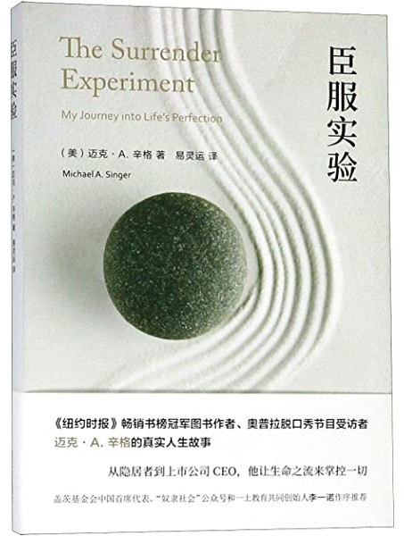

# booklist


|                                                              |                                                              |                                                              |
| ------------------------------------------------------------ | ------------------------------------------------------------ | ------------------------------------------------------------ |
| ![Amazon.com: 臣服实验: 5414029350605: 作者:[美国]（美）迈克·A. 辛格(Michael A. Singer)  著易灵运译: ספרים] |  |  |
|                                                              |                                                              |                                                              |
|  |  |  |
|                                                              |                                                              |                                                              |
|  |  | ]() |
|                                                              |                                                              |                                                              |
|  |  |  |
|                                                              |                                                              |                                                              |


```


<!--or-->


```

