# booklist

|                                                              |                                                              |                                                              |
| :----------------------------------------------------------: | :----------------------------------------------------------: | :----------------------------------------------------------: |
| [《臣服实验》迈克·A.辛格(Michael A. Singer)著 易灵运译](./notes/臣服实验_迈克·A.辛格.md)<br /> 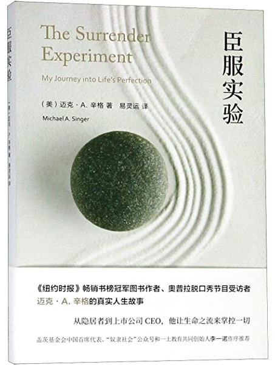 | 《清醒地活：超越自我的生命之旅》迈克·A.辛格(Michael A. Singer), 汪幼枫, 陈舒<br /> 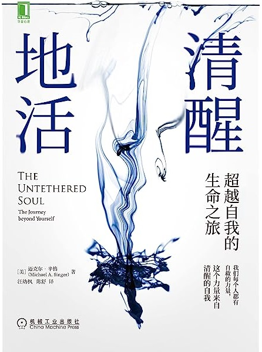 | 《不羁的灵魂:超越自我的旅程》迈克·A.辛格(Michael A. Singer)<br /> |
|                                                              |                                                              |                                                              |
| 《谈读书》 朱光潜<br />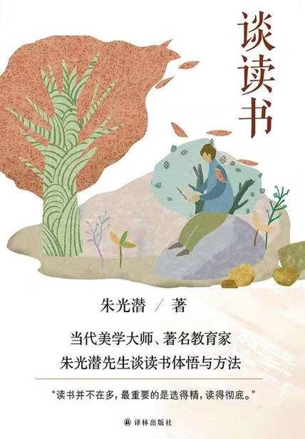 | 《给青年的十二封信》 朱光潜<br /> | 《美的历程》李泽厚<br />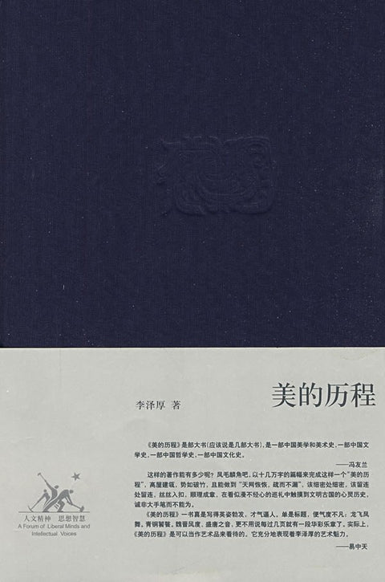 |
|                                                              |                                                              |                                                              |
| 《老子今注今译》 陈鼓应 注译 <br />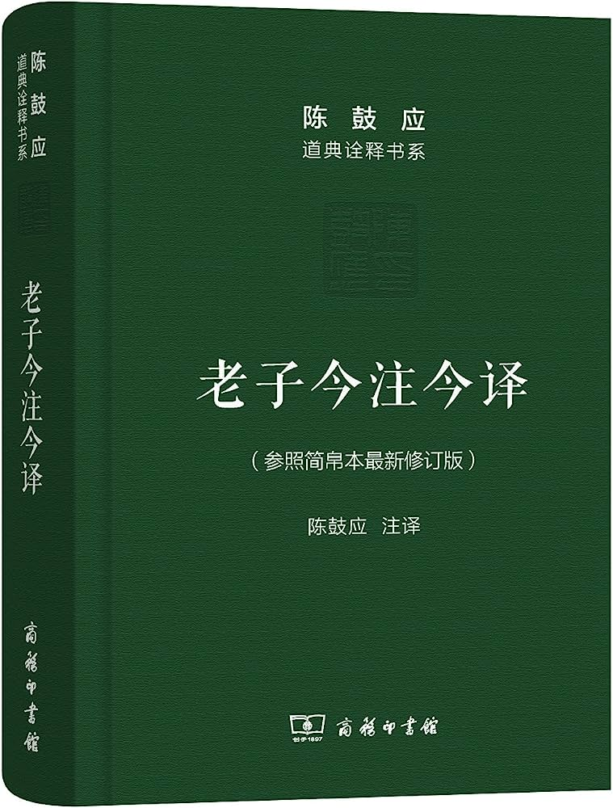 | 《庄子今注今译》(上下) 陈鼓应 注译<br /> 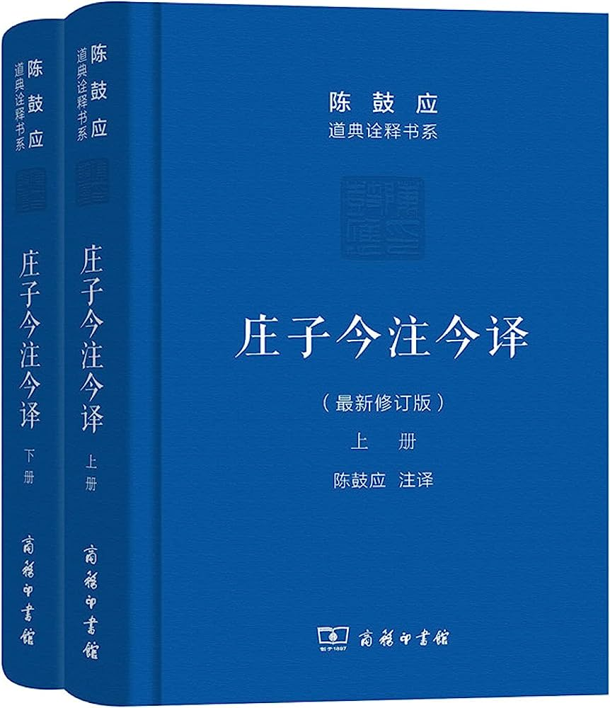 | 《周易今注今译》陈鼓应 注译 <br />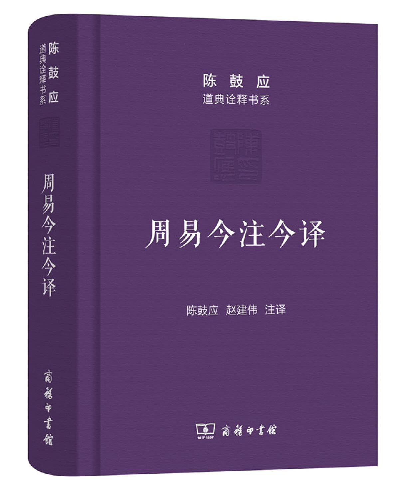 |
|                                                              |                                                              |                                                              |
| 《原则》 瑞·达利欧<br />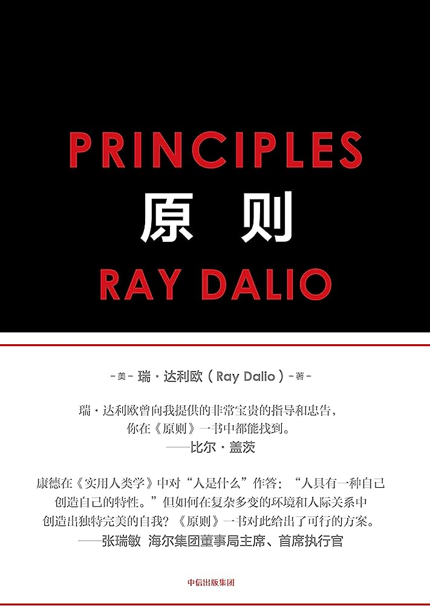 | 《原则：应对变化中的世界秩序》 瑞·达利欧<br /> 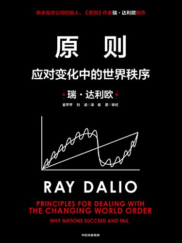 | 《债务危机》瑞·达利欧(Ray Dalio) <br />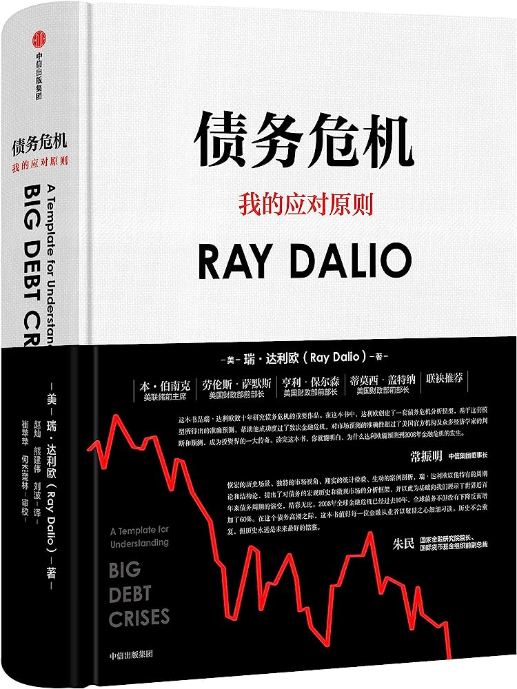 |
|                                                              |                                                              |                                                              |
| [《自我突围》 施一公](./notes/自我突围_施一公.md)<br /> | [《平面国》埃德温·A·艾勃特](./notes/平面国_埃德温·A·艾勃特.md)<br />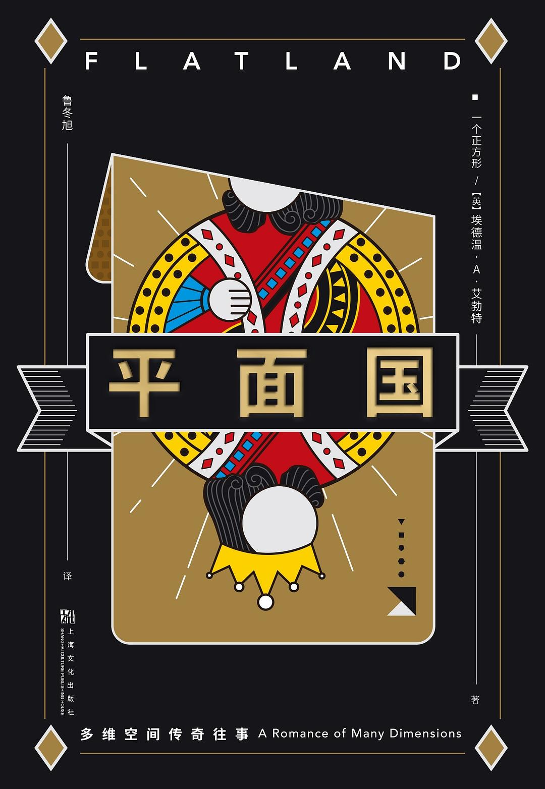 | [《xxx》 yyy](./notes/xxx_yyy.md)<br />

<!--or-->


```
