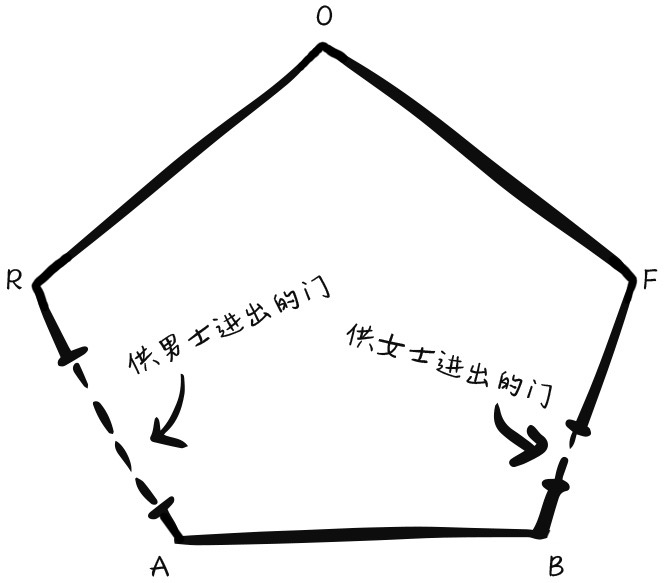
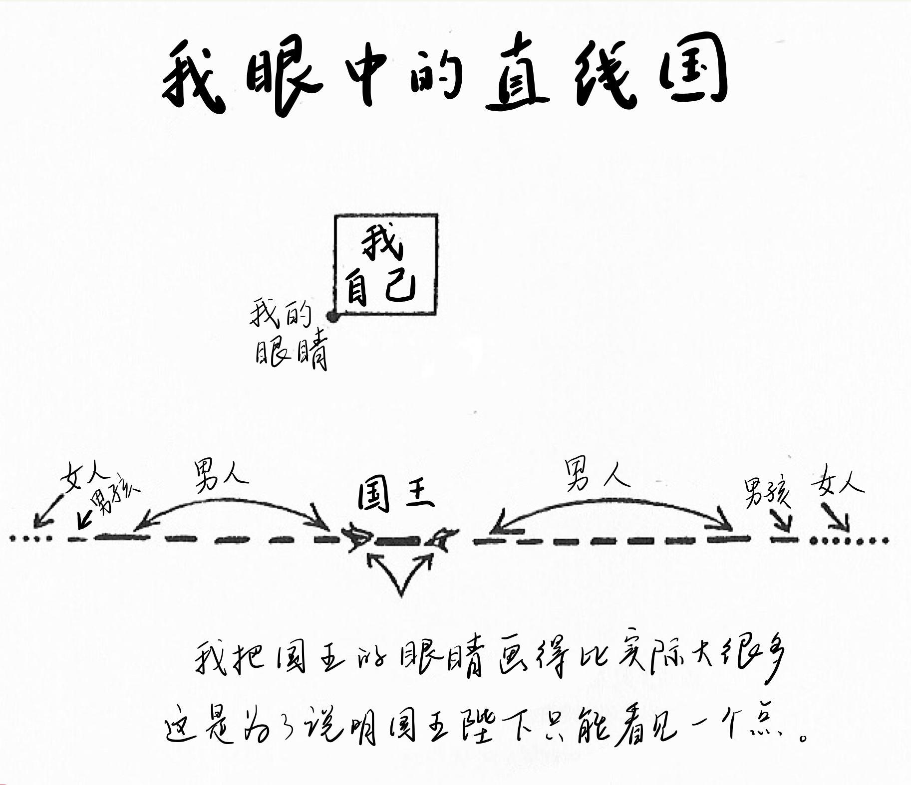
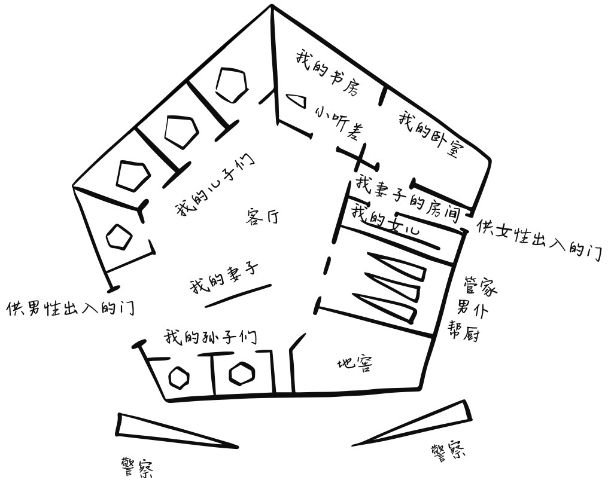
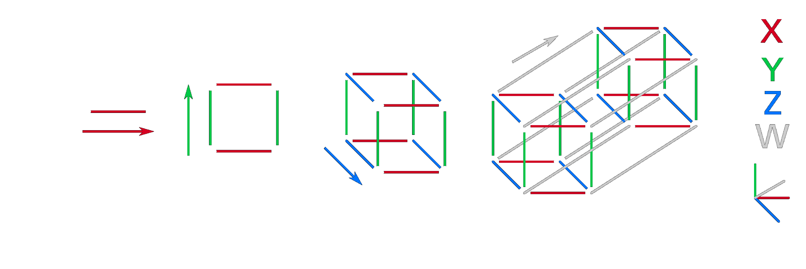
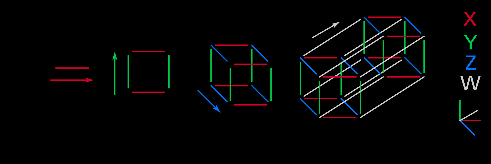

《平面国》总结

我最近看完一本书《平面国》，准备写一下读后笔记，想了好几天，拖延严重，都还没有开始动笔写，我想用以图形画的方式把这个笔记记录下来。

该书作者是以二维空间为背景来写此书的，主人公在其中是正方形。

在平面国中是有阶级划分的，划分依据是形状和边数。边数越多，等级越高。正方形＜五边形<六边形<七边形....<n边型<圆形。等级最高的是圆形。

另外，不规则图形是不允许存在的。

具体如：

一个小小的平面国社会，映射了一个大的现实社会。比如有阶层固化，人的思维的局限。

阶层固化，有这样的描述：

> 圆形阶级的教义可以被简单地总结为一句话：“注意自己的形状。”不管是在政治方面、宗教方面，还是在道德方面，他们的所有信条只有一个目的——提升自己的形状以及整个阶级的形状。当然，这里的“形状”特指圆形，对圆形阶级而言，形状以外的目标都是次要的。
>
> 人们往往不自觉地相信，人的行为取决于决心、努力、训练、鼓励、赞扬，或者其他一些东西。事实上，这只是一种古老的迷信，因为人的一切行为无疑只取决于形状。圆形有效地压制了那种异端邪说，让人们不再因为错误的信念而白白浪费精力和同情心，这是圆形阶级的伟大功绩。
>

人的思想的局限

主人公去了直线国，遇见了直线国的国王，展开了一番对话，无论主人公怎么讲述，国王就是不能理解另一个维度。比如二维的横纵，直线国只有横，无纵。

由此延伸，人几乎无法说服一个脑子已经固化的人。就相当于我们三位空间无法去理解四维空间一样。始终想不出那个一个W轴（除了X、Y、X）。

整本书也是我们理解更高维度空间的基础，作者从二维空间降维到一维空间，讲述一维空间的事情。然后又二维空间升级到三维空间讲述。在一维空间，正方形的主人公遇到了国王，由此认识了一维空间的生活方式、制度文化等等。

二维空间来了一个怪物—三维空间的球，球跟主人讲述了关于三维空间的种种事情。主人公不能理解，直到球带着主人公升维，提升高度，主人公才理解。

我们可以用这种方式去理解更高维度的空间，不用。。。

创建时间：

2022-02-26 16:42 周6

