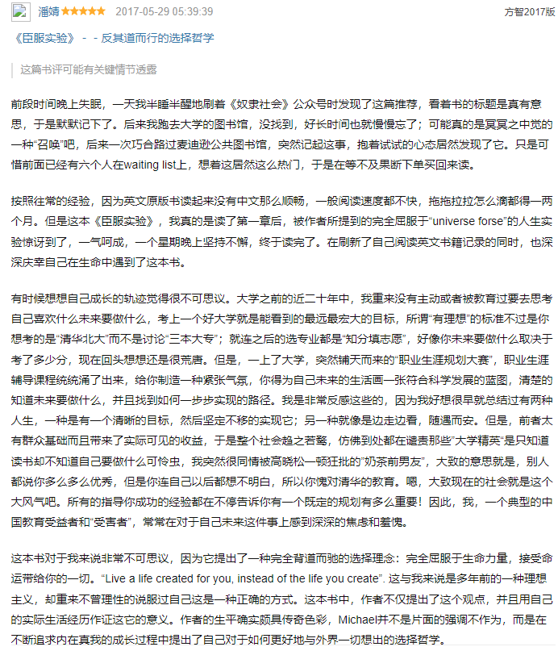

迈克•A.辛格，是世俗意义上极其成功的创业者和生意人，是瑜伽、冥想大师，是畅销书作家，在商业、艺术、教育、健康和环保等诸多领域均取得过耀眼成就：

他在佛罗里达密林深处创建了一处占地600英亩的静修社区“Temple of Universe”，该社区始于40多年前，今天已是久负盛名的瑜伽和冥想中心，世界各地的人都可以在自我发现之旅中来到这里感受内心的宁静；

他创办的第一个公司是建筑公司“Built with Love”，后来是 Medical Manager Corporation 的创办 CEO 和董事长，开发出全面改变了医疗管理行业的先进软件包；

Medical Manager Corporation在1997年上市，1999年就有超过10亿美元的估值，公司成就还被记入史密森学会的档案馆；

他写的书，登上《纽约时报》畅销书榜，成为奥普拉最爱的书，在土耳其、巴西、西班牙、瑞士、日本、中国台湾、荷兰、丹麦、芬兰、波兰、意大利等十几个国家和地区相继出版，他由此成为无数读者的心灵导师；

…………

《臣服实验》将讲述这一切是怎么来的，讲述这40多年中辛格的内心历程。

讲述始于他20岁出头时，那时他还是一个经济学在读博士，只想在林中独居。

在一次深层次的灵魂觉醒后，辛格决定：放弃自我的偏见和喜恶，放手让生命本身来执掌人生之舵。亦即臣服于生命。

以仅有一次的人生为赌注的这场大胆实验，结果给他带来了40年的非凡之旅，让他走入生命之完美。

辛格将通过自己的讲述，带你看到一个人的痛苦、纠结、探寻、发现，以及最终的绽放。

你将发现，选择臣服之后，人生可能出现的种种奇迹。

