 # 《额尔古纳河右岸》读书笔记

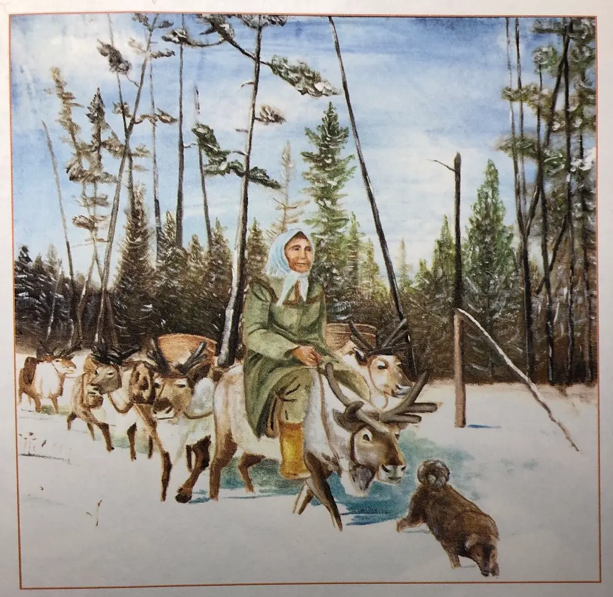

本文包含剧透内容！！！

今日 （2022年9月8日） 读完迟子建的《额尔古纳河右岸》，大概用了10天下班后的时间。刚到18:00下班时间，就赶紧背起书包往家跑。兴冲冲的尽快到家，想把读书过程的感想，书中有趣的事情，人物关系脉络都梳理和记录下来。

‍

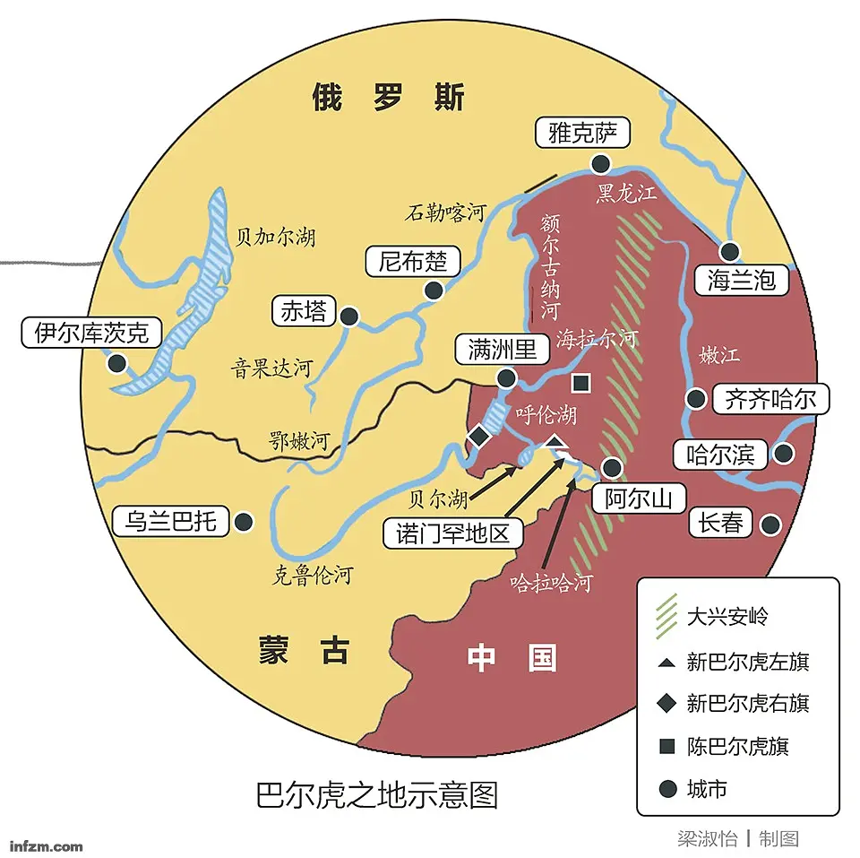

## **乌力楞**

一般来说，就是所谓的“自然村”“自然屯”“牧养点”“住家”“住户”等。

用牧养驯鹿的鄂温克人的语言，把他们自愿组合而成的社会最小组织结构自然村就叫“乌力楞”（wurirnŋ）。

特别是在早期，他们和“刘家村”“张家屯”一样，以姓氏或家族为单位，自愿组成若干个自然村来安排生产生活，并由德高望重而年长的村长及萨满共同管理自然村的日常事务。其中，自然村的村长主要管理属于物质世界的生产生活，而萨满则管理属于精神世界的一切事物。

## **希楞柱**

书中讲到鄂温克人住的房子，叫**希楞柱**，也叫仙人柱，撮(cuō)罗子。

“仙人住”就是用相接或连接手段搭建的房屋。“仙人住”一词是鄂温克语xieren zhu的转写形式。鄂温克语中xieren（仙人）表示“相接、衔接、连接”等，而zhu（住）是指“房子”或“住处”。由这两个词构成的复合名词xieren zhu（仙人住）应该表示“以相接或连接形式搭建的房子”之意。用桦树皮或动物毛皮搭建的圆锥形住处。

到了夏天或春秋天暖时，就要用桦树皮搭建仙人住；到了冬天或春秋天冷时，就用动物毛皮搭建仙人住。毫无疑问，仙人住是鄂温克人古老而传统的住房，有人把鄂温克语xieren zhu（仙人住）用汉文转写为“仙人柱”“仙仁住”“斜仁住”等，也有的人干脆写成“撮罗子”。

鄂温克族早期的草原与山林中的游牧生活，注定了他们在某一居住点不能生活过长，甚至居住时间不能超过10天半个月。频繁而紧张的迁徙性游牧生活，自然决定了牧区和山林鄂温克族牧人居住房屋的临时性、暂时性、移动性、灵活性和携带型。他们的房子应该具备搭建快捷、拆卸方便、搬迁容易的条件与要求。

> 我从小看到的房屋就是像伞一样的希楞柱，我们也叫它“仙人柱”。希楞柱很容易建造，砍上二三十根的落叶松杆，锯成两人高的样子，剥了皮，将一头削尖了，让尖头朝向天空，汇集在一起；松木杆的另一端则贴着地，均匀地散布开来，好像无数条跳舞的腿，形成一个大圆圈，外面苫上挡风御寒的围子，希楞柱就建成了。早期我们用桦皮和兽皮做围子，后来很多人用帆布和毛毡了。 我喜欢住在希楞柱里，它的尖顶处有一个小孔，自然而然成了火塘排烟的通道。我常在夜晚时透过这个小孔看星星。从这里看到的星星只有不多的几颗，但它们异常明亮，就像是擎在希楞柱顶上的油灯似的。

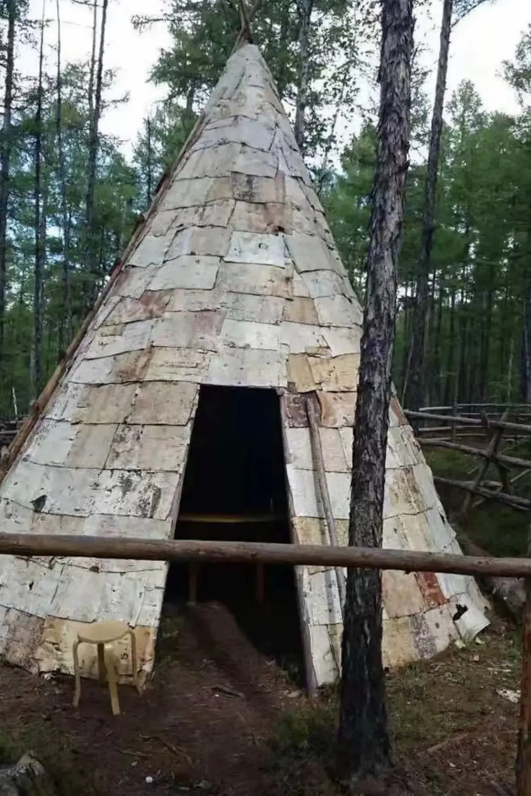

桦树皮的希楞柱

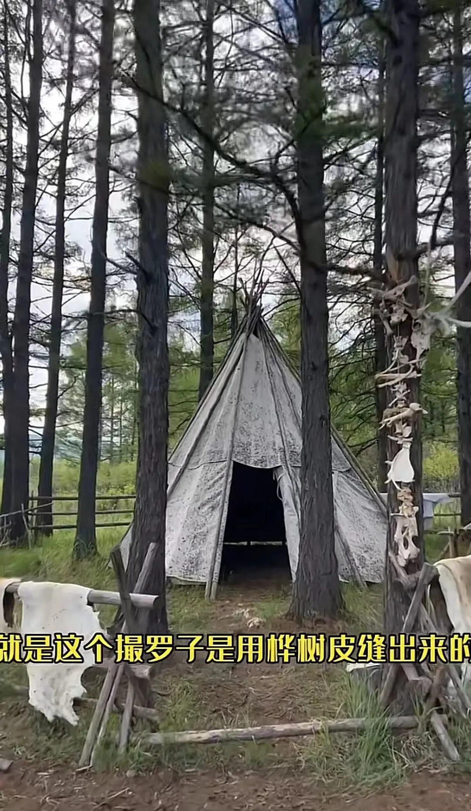

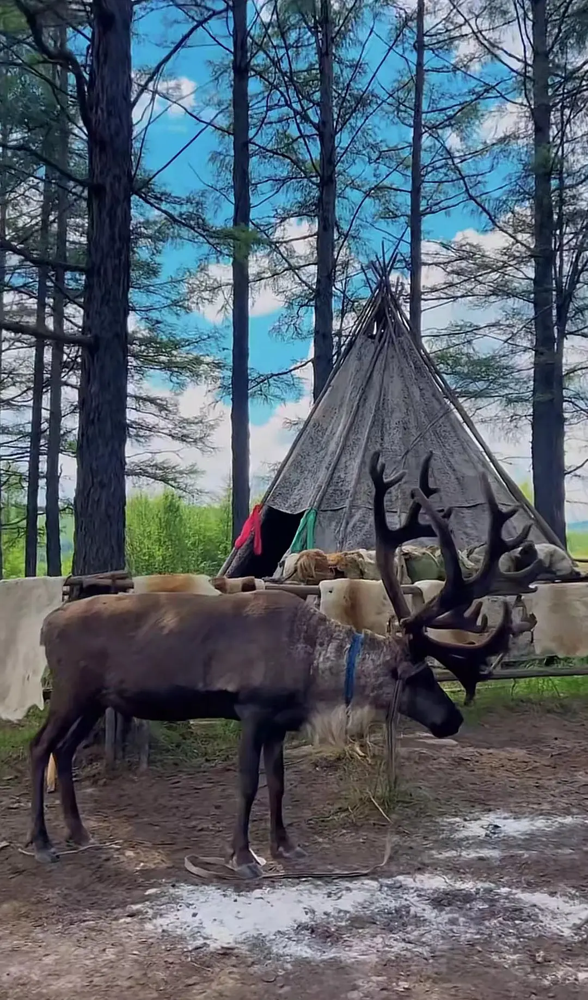

## **靠老宝**

靠老宝是指树上的仓库。牧养驯鹿的鄂温克人还有搭建靠老宝的习惯。

搭建是选定自然生长的相互间距离整齐的4根活树，然后在其高3米处空中搭建的木屋。

里面放置和储藏各种生活用品，包括多余的粮食、衣物、生产生活用具等。这种仓库的功能主要在于能够防备熊等野兽偷食储藏物，也能防备食物或衣物变潮发霉。

取储存物品时，使用专制的独木梯子。

每当在夏天搬迁时，有的人只是卸下木架上的桦树皮拿走，有的人家把桦树皮仙人住原封不动地留在原地搬走；在冬天搬迁时，大家都将覆盖在木架上的兽皮盖子带走，而将木架子留在原处不动。不过也有的人家，用雪橇连同木架子的木棍也都带走。

不论怎么说，对于在山林中伴随牧场的四季变化四处游牧的人来讲，仙人住是最好最适合于他们生产生活的住处。因为，它具有就地可以取材，搭建和拆卸又十分便利，就是随时拆下来带走也不费劲或麻烦。而作为山林仓库的靠老宝则永远留在原地，备作以后再迁移到此处时使用。

书中这样描述：

> 几乎每个乌力楞在山中都建有靠老宝，少则两三个，多则四五个。 盖靠老宝要在林子中选择四棵粗细相等、间距适中的松树，把树身的枝桠打掉，然后再截断树冠，以这四根自然竖立着的树干为柱子，然后在这四柱上，搭上用松木杆铺成的底座和长方形的四框，框子上面苫上桦树皮，在底部留一个开口，作为送取东西的进出口。 搬迁的时候，我们会把平时闲置和富余的东西放在里面，比如衣物、皮张、食品等，以备需要的时候来取。靠老宝高高在上，所以野兽是不能把它毁坏的。 有了靠老宝，还一定要做一个梯子，因为那仓库足足有两人高，不靠梯子是无法攀爬上去的。梯子一般放在靠老宝下面的树林中，平放着，需要时才竖起来。 早期的时候，我们的靠老宝还常遭到黄鼠狼和山猫的偷袭，它们顺着四柱爬到靠老宝里面，偷取食物。为了防备它们，以后再建靠老宝时，我们就把四柱的外皮剥掉，树一变得光滑起来，它们就不容易爬上去了。再后来，我们还用薄铁皮包裹上四柱，铰出一些锯齿，这样再灵敏的动物也不敢以损伤爪子为代价而去攀爬了。除了黑熊有能力搬起梯子爬上靠老宝，其他动物只能眼巴巴地看着这座肥美的空中仓库，空舔着舌头。 我在离靠老宝很近的一棵枫桦树下找到了梯子，将它立起来，爬到上面。从我记事的时候起，大人们爱跟我们说这样两句话，一句是“你出门是不会带着自己的家的，外来的人也不会背着自己的锅走的”，另一句是“有烟火的屋子才有人进来，有枝的树才有鸟落”，所以我们的靠老宝从不上锁，即使你路过的不是本氏族的靠老宝，如果确实急需东西，完全可以自取。取过后，将来把东西再还回来就是。就是不还的话，也没有人抱怨过路人取了里面的东西。

‍

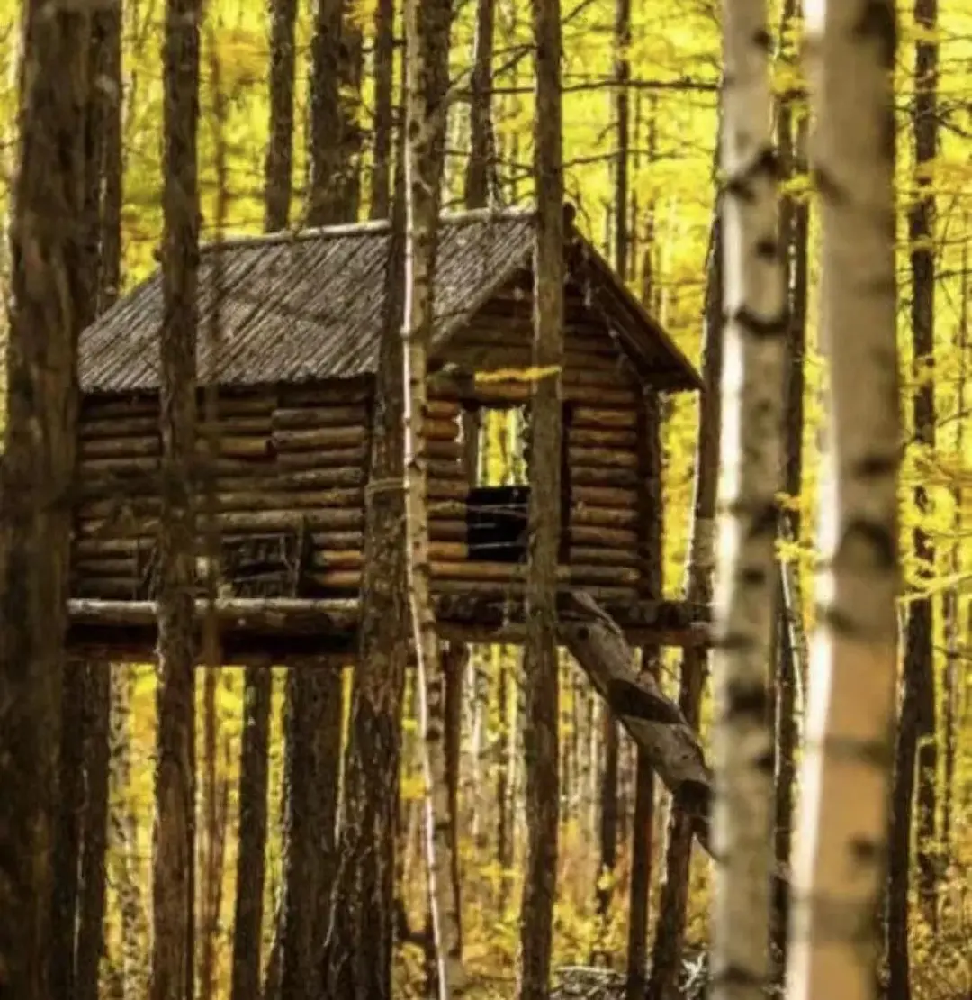

靠老宝

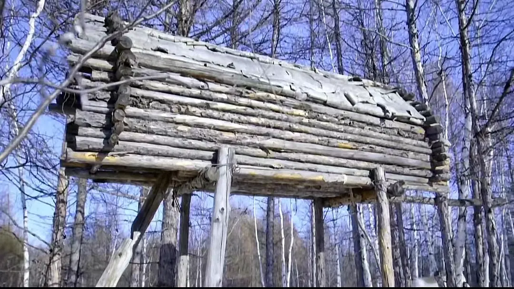

靠老宝

## **驯鹿**

驯鹿吃苔藓(石蕊)和蘑菇。驯鹿又称角鹿，跟麋鹿不一样。

文中对驯鹿的描述：

> 据说在勒拿河时代，**我们的祖先就放养驯鹿。**那里森林茂盛，被我们称做“恩克”和“拉沃可塔”的苔藓、石蕊遍布，为驯鹿提供了丰富的食物。那时的驯鹿被叫做“索格召”，而现在我们叫它“奥荣”。 它有着马一样的头，鹿一样的角，驴一样的身躯和牛一样的蹄子。似马非马，似鹿非鹿，似驴非驴，似牛非牛，所以汉族人叫它“四不象”。我觉得它身上既有马头的威武、鹿角的美丽；又有驴身的健壮和牛蹄的强劲。过去的驯鹿主要是灰色和褐色，现在却有多种颜色：灰褐色、灰黑色、白色和花色等。而我最喜欢白色的，白色的驯鹿在我眼中就是飘拂在大地上的云朵。 我从来没有见过哪种动物会像驯鹿这样性情温顺而富有耐力，它们虽然个头大，但非常灵活。负载着很重的东西穿山林，越沼泽，对它们来说是那么的轻松。 它浑身是宝，皮毛可御寒，茸角、鹿筋、鹿鞭、鹿心血、鹿胎是安达最愿意收入囊中的名贵药材，可换来我们的生活用品。鹿奶是清晨时流入我们身体的最甘甜的清泉。 行猎时，它们是猎人的好帮手，只要你把打到的猎物放到它身上，它就会独自把它们安全运到营地。搬迁时，它们不仅负载着我们那些吃的和用的东西，妇女、孩子以及年老体弱的人还要骑乘它。 而它却不需要人过多地胴应。它们总是自己寻找食物，森林就是它们的粮仓。除了吃苔藓和石蕊外，春季它们也吃青草、草间荆以及白头翁等。夏季呢，它们也啃桦树和柳树的叶子。到了秋天，鲜美的林间蘑菇是它们最爱吃的东西。 它们吃东西很爱惜，它们从草地走过，是一边行走一边轻轻啃着青草的，所以那草地总是毫发未损的样子，该绿还是绿的。它们吃桦树和柳树的叶子，也是啃几口就离开，那树依然枝叶茂盛。它们夏季渴了喝河水，冬季则吃雪。只要你在它们的颈下拴上铃铛，它们走到哪里你都不用担心，狼会被那响声吓走，而你会从风儿送来的鹿铃声中，知道它们在哪里。 驯鹿一定是神赐予我们的，没有它们，就没有我们。虽然它曾经带走了我的亲人，但我还是那么爱它。看不到它们的眼睛，就像白天看不到太阳，夜晚看不到星星一样，会让人在心底发出叹息的。 我最不愿意看到的情景，就是给驯鹿锯茸。锯茸用的是骨锯。每年的五月到七月，驯鹿的茸角就生成了，这一段时间也就成了锯茸的日子。锯茸不像打猎，通常是由男人来做的，锯茸的活儿女人们也要做。 驯鹿不分雌雄，均长茸角。一般来说，雄鹿的茸角粗壮，而那些去势的驯鹿茸角就细弱。 锯茸的时候，驯鹿要被拴在树上，两边用木杆夹住。茸角也是它们的骨肉啊，所以锯茸的时候，驯鹿疼得四蹄捣来捣去的，骨锯上沾染了鲜血。锯下茸角后，要烧烙茸根，以防出血。不过烧烙茸根是过去的老法子了，现在锯完茸后，撒上一些白色的消炎粉末就可以了。

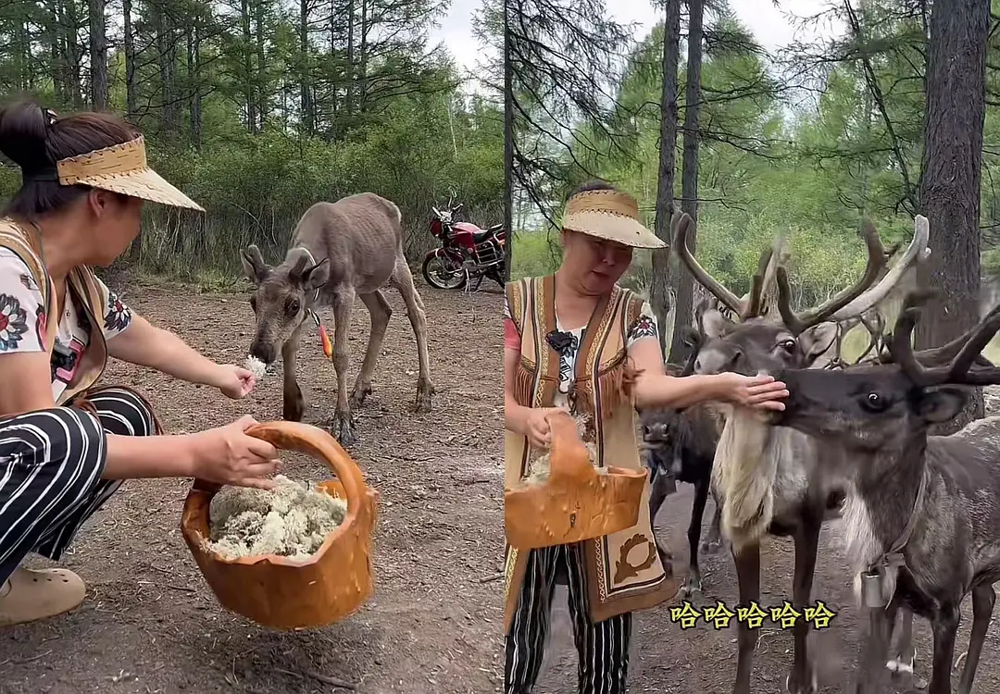

驯鹿、苔藓(石蕊)

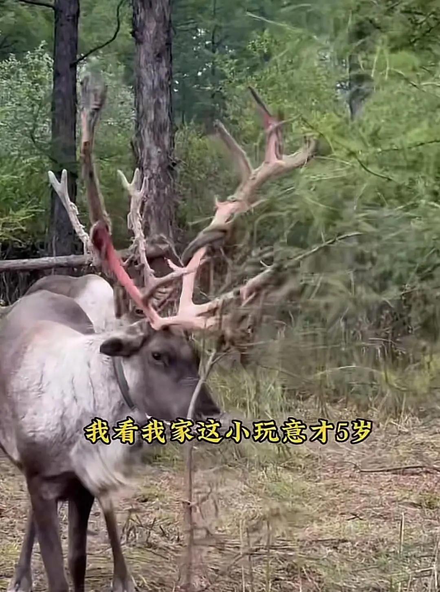

驯鹿脱茸

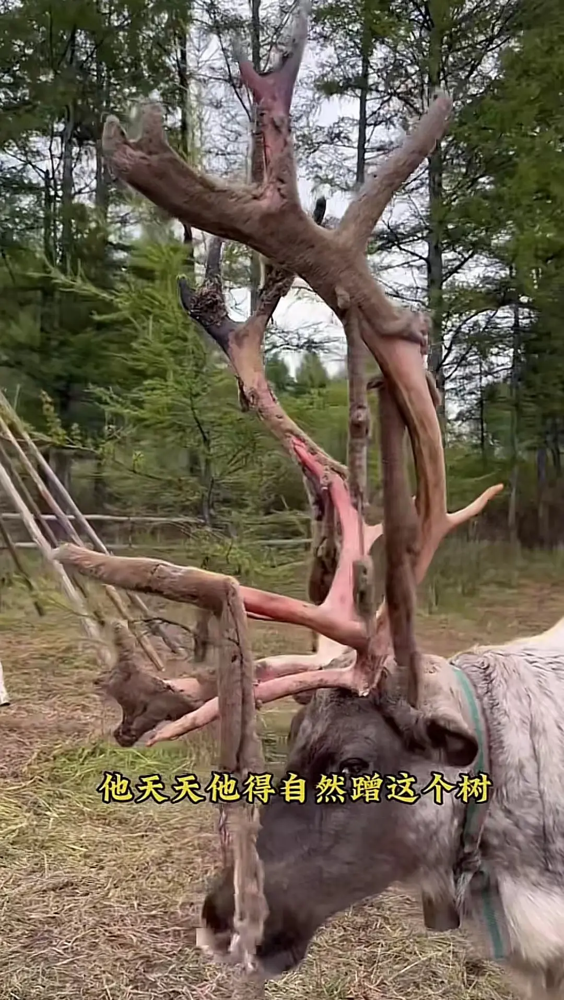

驯鹿脱茸

## **桦树**

桦树也算鄂温克人懒以生存的宝物。

鄂温克人用桦树皮做很多东西。桦树也当做木料，柱子等。

如桦皮碗、桦皮篓、桦皮花瓶、桦皮糖盒、桦皮盐盒、桦皮桶、桦皮船，桦皮围子(用在希楞柱)，尸体包裹。

桦皮工艺品。桦皮做成的烟盒、笔筒、茶叶罐、首饰盒等，还可以雕刻上飞鸟、驯鹿、花朵、树木云雷纹、水波纹等形象。

春天可以喝桦树汁。优质白桦树采汁时间:**4月中下旬至5月初15天之内**。

剥桦树皮片段：

> 她还喜欢在剥取桦树皮的时候，把树干上那粘稠的浆汁刮下来食用。她剥桦树皮，比男人还有技巧。她握着一把锋利的猎刀，选择那些粗细均匀、表皮光滑的白桦树，在桦树皮最厚实的地方，从上往下先划一道口子，然后用刀横切上头，绕树一周，再横切下面，一块桦树皮就被顺利地揭下来了。因为剥的都是树干，所以脱去了树皮的白桦树在被剥的那一年是光着身子的，次年，它的颜色变得灰黑，仿佛是穿上了一条深色裤子。然而又过了一两年，被剥的地方就会生出新鲜的嫩皮，它又给自己穿上耀眼的白袍子了。所以我觉得白桦树是个好裁缝，她能自己给自己做衣裳穿。

做桶和盒子：

> 如果是做桶和盒子，这样的桦树皮只需在火上微微烤一下，使它变得柔软就可以用了。桶可以来盛水，而那形形色色的盒子可以装盐、茶、糖和烟。

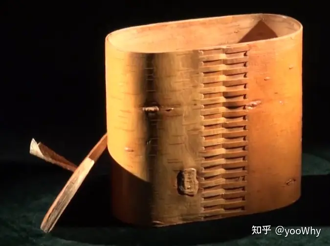

桦树皮工艺品

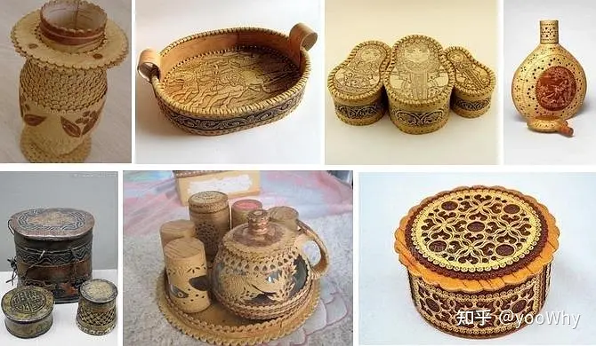

桦树皮工艺品

做桦皮船：

> 做桦皮船的，就是大张的桦树皮了。这样的桦树皮要放到大铁锅里煮一下，然后捞出，沥干水，就可以做船了。我们把桦皮船叫做“佳乌”。做佳乌要用松木做船的骨架，然后再把桦树皮包在它身上。我们用红松的根须当作线，把接头连缀在一起。然后再用松树油和桦树油混合在一起熬制成的胶，把缝隙弥上。佳乌很窄，但很长，有多长呢?足足有四五个人连在一起的身长。它的两头尖尖的，无头无尾，站在哪个端头，哪个端头就是船头。它入了水后非常轻灵，就好像一条大白鱼。每个乌力楞都要有三四个佳乌。它们平时被放在营地，需要时，轻便的它能让人一提就走。如果夏季时在一个营地住得长久，人们就会把佳乌放在河边，使用时就更方便了。

取桦树汁：

> 白桦树是森林中穿着最为亮堂的树。它们披着丝绒一样的白袍子，白袍子上点缀着一朵又一朵黑色的花纹。你只要用猎刀在树根那里轻轻划一个口，插上一根草棍，摆好桦皮桶，桦树汁就顺着草棍像泉水一样流进了桦皮桶里。那汁液纯净透明，非常清甜，喝上一口，满嘴都是清香。以前我是和列娜一起去采桦树汁的，列娜走了，我就和鲁尼一起去。鲁尼每次都是先蹲在树根那儿，嘴里叼着草棍，待自己喝足了，才让桦树汁流进桶里。

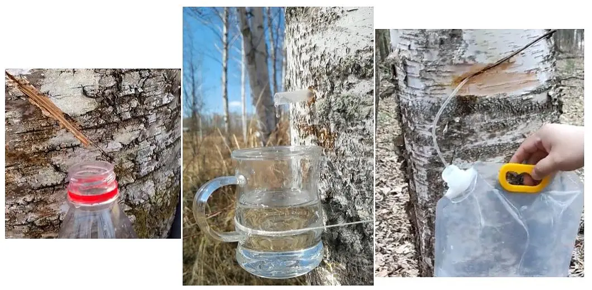

取白桦树汁

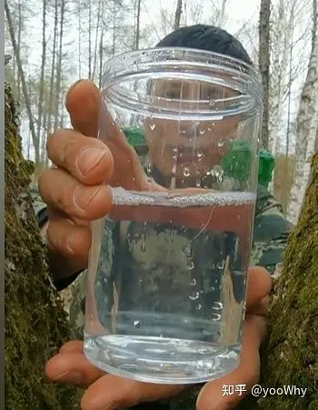

白桦树汁

## **男人干活**

打猎，猎物运回营地，找丢失的驯鹿，锯驯鹿茸

## **女人干活**

看管小孩

剥皮，卸肉，熟皮子，熏肉干，做桦皮篓和桦皮船，缝狍皮靴子和手套，烙格列巴饼，挤驯鹿奶，做鞍桥等

‍

## **夫妻的风声**

> 深夜，希楞柱外常有风声传来。冬日的风中往往夹杂着野兽的叫声，而夏日的风中常有猫头鹰的叫声和蛙鸣。**希楞柱里，也有风声，风声中夹杂着父亲的喘息和母亲的呢喃，这种特别的风声是母亲达玛拉和父亲林克制造的。母亲平素从来不叫父亲的名字，而到了深夜他们弄出了风一样响声的时刻，她总是热切地颤抖地呼唤着，林克，林克。父亲呢，他像头濒临死亡的怪兽，沉重地喘息着，让我以为他们害了重病。**然而第二天早晨醒来，他们却面色红润地忙着自己的活计。就在这样的风声中，母亲的肚子一天天大了起来，不久，我的弟弟鲁尼降生了。

‍

> 由于尼都萨满很少跳舞，瘸子达西也不能参加，所以跳舞的时候，外圈的男人就要一直展开着胳膊，否则就不能把女人护卫在里圈。所以跳着跳着，里圈的女人就会跳到外圈，最后形成一个大圈。大家手拉着手，一直跳到篝火暗淡，星星也暗淡下去，这才回希楞柱睡觉。母亲喜欢跳舞，她一跳了舞就睡不着觉。**跳过舞的夜晚，我总能听见她小声对父亲说，林克，林克，我的脑袋里灌了凉水，我睡不着。林克不说什么，他送给达玛拉一种我听惯了的风声，风声过后，达玛拉就睡着了。**

‍

> 我们回到营地后，父亲把猎到堪达罕的地点告诉给乌力楞的其他人，伊万、哈谢和坤得就在深夜里出发，去驮运它了。林克像个功臣似的，留下来休息了。**那个晚上他一定很高兴，他和达玛拉在希楞柱里制造出很激烈的风声，只听得母亲一遍又一遍地呼唤着他的名字。**在这样的风声中，我的眼前闪现的却是那轮黑色的月亮，它撕裂了我的梦境，使我在东方现出白光的时候才沉沉睡去。

‍

> 我的婚礼是简朴的，不过是两个乌力楞的人聚集在一起，围着篝火吃了一次饭。那个聚会没有喜庆的气氛，伊万喝醉了，把酒肉呕吐在篝火上，依芙琳直蹙眉，我知道，她觉得这是不吉祥的征兆。达玛拉和尼都萨满表情冷淡，他们甚至都没有对我说一句祝福的话。可我却觉得无比幸福。**当那个晚上我和拉吉达紧紧拥抱在一起，在新搭建的一座希楞柱里，制造出属于我们自己的强劲的风声的时候，我觉得自己是天底下最幸福的女人。**我记得那是个月圆之夜，从希楞柱的尖顶，可以看见一轮银白的月亮。**我把头埋进拉吉达的怀里，告诉他我从来没有觉得这么温暖过。拉吉达对我说，他会让这种温暖永远伴随我。**他亲吻着我的一双乳房，称它们一个是他的太阳，一个是他的月亮，它们会给他带来永远的光明。拉吉达那天晚上说了好几个“永远”，这很像誓言，而誓言很少有永远的。

‍

> 我们用了两天时间，把新碱场做成了。拉吉达趴在我耳边说，这片松软的碱土就是最好的铺，我们应该在这里要一个女儿。他的话让我激动起来，我仿佛看见了像花蝴蝶一样围绕着我们的女孩，我说，这真是个好主意。**春日的阳光是那么和煦，它们照耀着新碱场，那丝丝白光就像入了土的盐发出的芽，鲜润明媚。我们无所顾忌地拥抱在一起，为这春光注入一股清风。**那是最缠绵的一次亲昵，也是最长久的一次亲昵，我的身下是温热的碱土，上面是我爱的男人，而我爱的男人上面，就是蓝天。在那个动人的缠绵的过程中，**我一直看着天上的云。有一片白云连绵在一起，由东向西飘荡着，看上去就像一条天河。而我的身下，也流淌着一条河流，那是女人身下独有的一条暗河，它只为所爱的男人涌流。**

‍

> 在那段岁月，我相信照耀温都翁河的是两轮月亮，一轮在天上，由神托举着；一轮在岩石上，由我的梦托举着。 当我在月亮升起后回到营地时，瓦罗加站在希楞柱外焦急地等待着我。我在见到他的那一瞬，忽然有种久别重逢的感觉，抑制不住地哭了起来。因为岩石上的图景和现实的图景都令我感动。我没有告诉他自己去哪里了，因为我觉得自己做的事情，是和岩石之间的一个秘密。瓦罗加什么也没有问，他只是为我递上一碗煮好的鹿奶茶。一个好男人，是不会追问女人的去处的。 那个夜晚瓦罗加是那么紧地拥抱着我，达吉亚娜温柔的鼾声像春风一样回荡在希楞柱里。**我和瓦罗加是那么完美地融合在一起，就像鱼与水的融合，花朵与雨露的融合，清风与鸟语的融合，月亮与银河的融合。** 也就是在那个夜晚，瓦罗加给我低低吟唱了一支他自己编的歌，他唱的歌与妮浩唱的神歌不同，是那么的温暖。 清晨的露珠湿眼睛 正午的阳光晒脊梁 黄昏的鹿铃最清凉 夜晚的小鸟要归林 当瓦罗加唱到最后一句“夜晚的小鸟要归林”的时候，他拍了拍我的脊梁。只这轻轻的一拍，却使我的眼睛湿了。好在是在黑夜中，他看不清我的泪痕。我把头深深地埋进他怀里，就像一只鸟偎在温暖的巢穴里。

‍

> 伊万回来的那天，大家喝了很多酒。那天晚上我是那么想和瓦罗加在一起。达吉亚娜已经是大姑娘了，我怕我们在深夜制造的风声会吓着她，虽然说她就是听着这样的风声长大的。但是那个晚上不一样，因为酒像火苗一样，把我和瓦罗加的激情点燃了，热情相撞的风声，一定会比平时更加的强烈。我依偎在瓦罗加的怀里，我们企图用谈话来克制激情。我问他，你愿意到山下定居吗?瓦罗加说，那得问问驯鹿，它们愿意下山吗?我说，驯鹿肯定不会愿意。瓦罗加说，那我们就要服从驯鹿。不过他说完之后叹息了一声，说，山里的树如果这么伐下去，早晚有一天，我们不下山，也得下山了。我说，山上的树多着呢，砍不光的!瓦罗加又叹息了一声，说，我们迟早有一天要离开这里的。我问他，如果我留在山里，驯鹿下山了，你怎么办呢?瓦罗加温柔地说，我当然要跟你留在一起了。驯鹿是大家的，你是我唯一的!他的话更加激起了我的渴望，我们拥抱得更紧了，我们互相亲吻着，激情终于像浓云背后的雷声一样轰隆隆地爆发了。**瓦罗加伏在我的身上，他就像一片醉人的春日阳光，把我融化了。我得感谢那晚上大自然的风声，当我们开始畅游我们那条隐秘的生命之河、享受着那独有的快乐的时候，希楞柱外刮起了一阵狂风。风声是那么的响亮，好像是特意为我们的激情做掩护和伴奏的。**当我被欢乐浸透，软绵绵地躺在瓦罗加的怀抱中的时候，我觉得瓦罗加就是我的山，是一座挺拔的山；而我自己轻飘得就像一片云，一片永远飘在他身下的云。

‍

> **瓦罗加和我也一天天地衰老了。虽然我们还睡在一起，但是再也没有制造风声的激情了。**看来真正的风神在天上。那几年我画的两处岩画，都跟风神有关。我画的风神没有五官，可以说它是男人，也可以说它是女人。我把风神的头发画得格外的长，长得就像银河一样。

‍

## **主人公对男人的感受**

> 当我苏醒过来的时候，已经在瓦罗加的怀里了。每个男人的怀抱都不一样，我在拉吉达怀中的时候，**感觉自己是一缕穿行在山谷间的风**；而在瓦罗加怀里，我**感觉自己就是一条畅游在春水中的鱼**。如果说拉吉达是一棵挺拔的大树的话，瓦罗加就是大树上温暖的鸟巢。他们都是我的爱。

‍

## **关于学习的不同意见**

> 一九五九年的时候，政府为我们在乌启罗夫盖起了几栋木刻楞房。有几个氏族的人开始不定期地到那里居住。但他们总是住不长，还是喜欢山里的生活。所以那些房子多半闲着，很少有炊烟。那里有了小学，鄂温克猎民的孩子可以免费入学，瓦罗加建议把达吉亚娜送去上学。 在上学的问题上，我和瓦罗加意见不一，**他认为孩子应该到学堂里学习**，而**我认为孩子在山里认得各种植物动物，懂得与它们和睦相处，看得出风霜雨雪变幻的征兆，也是学习。** 我始终不能相信从书本上能学来一个光明的世界、幸福的世界。但瓦罗加却说有了知识的人，才会有眼界看到这世界的光明。 可我觉得光明就在河流旁的岩石画上，在那一棵连着一棵的树木上，在花朵的露珠上，在希楞柱尖顶的星光上，在驯鹿的犄角上。如果这样的光明不是光明，什么又会是光明呢! 达吉亚娜最终还是没有去上学，但瓦罗加得闲时开始教她和马伊堪识字，他用树枝做笔，用土地做纸，在上面写上一些字，教她们念。达吉亚娜喜欢学字，马伊堪就不行了，她学着学着，就会打盹。拉吉米心疼马伊堪，就不让她学字了，说是瓦罗加弄了一些蚂蚁，塞到马伊堪的脑袋里了，他可不能让那些蚂蚁害了他的宝贝女儿。

‍

## **安草儿为电影中的人煮奶茶**

> 天一擦黑，放映员让我们把白色的幕布挂在树上，将发电机隆隆地发动起来，支起放映机，开始放电影了。当一束银白的光扫到银幕上时，席地而坐的我们不由得发出阵阵惊叹，蜷伏在银幕背后的猎犬也发出惊恐的叫声。**幕布上奇迹般地出现了房屋、树木和人的影子，而且是带着颜色的。那上面的人不仅能随意走动，还能说话和唱歌，真让人觉得不可思议。那个电影讲的什么故事我已经忘了，因为里面的人说着说着话，就要端个姿势，咿咿呀呀地唱—上半晌。**唱词我们是听不懂的，所以整部电影看得稀里糊涂的。但我们还是为此而兴奋，因为毕竟从一块小小的幕布上，看到了无限的风景。 放映员跟我们说，现在的电影不如以前的好看，就那么几部，还都是以唱戏为主的。他说以前的电影虽然是黑白的，但是有人情味，耐看。马粪包生气了，说，有好看的，为什么给我们放难看的?你这不是欺负我们的眼睛吗?放映员赶紧解释说，以前那些好看的，都被当作“毒草”，封存起来，不让放映了。马粪包说，你这是骗人呢，好看的东西怎么会被藏起来?再说了，电影又不能吃，怎么会被当作毒草呢，这分明是在胡说八道!马粪包激动了，要揍放映员。瓦罗加赶紧上前安抚，马粪包说只有放映员干了一碗酒，他才会饶过他。放映员只得把递来的那碗酒一口气喝干。 电影放映完了，但是快乐还在继续。我们围着篝火，开始了又一轮的唱歌跳舞。人们乘着酒兴，让放映员也给我们唱首歌。那时他已被马粪包递上的那碗酒灌晕了，他东摇西晃着，硬着舌头说自己不会唱歌，问可不可以朗诵一首词来代替?大家说可以。放映员只念了一句：大江东去，浪淘尽，千古风流人物!就一头跌倒在地，醉得人事不醒了。他念的那句词和他的突然倒地，让人产生了奇妙的联想，惹得大家笑起来。我们开始喜欢上这个放映员，因为只有诚实的人才会被醉倒。 欢聚到月亮偏西时，附近两个乌力楞的人陆续离开了，他们之所以赶夜路回去，完全是为了驯鹿。如果晨归的驯鹿发现主人不见了，一定会慌张的。 **第二天早晨，我起来后发现安草儿已经在忙活早饭了，他在煮奶茶。平时我们只煮一壶，可那天他煮开了一壶后，把它倒在桦皮桶里存起来，盖上盖子，又煮了一壶。我以为他想多喝点，也就没问。可当他煮第三壶时，我觉得有点不对头了，就对他说，昨晚那些看电影的人已经回去了，我们现在不过是多了一个放映员，再怎么喝，也喝不了三壶啊!谁知安草儿很认真对我说，他们是走了，可昨晚电影上还来了好多人呢，我看男男女女、老老少少的也一大帮!我刚才去找他们，也没见，不知他们昨晚都睡在哪里了?等一会儿他们回来了，不也得喝奶茶吗?安草儿的话让我笑了起来，他在我的笑声中有些不自在，喃喃地说，电影上的人都走了吗?他们唱了半宿，没吃饭就走，怎么会有力气呢?**我回到希楞柱，把安草儿说的那番话告诉给瓦罗加，他也笑了。但笑过之后我们都沉默了，因为辛酸还是涌上了心头。

‍

## **城市和山上**

依莲娜在山上呆烦了，会背着她的画返回城市。然而要不了多久，她又会回来。她每次回来时都兴冲冲的，说是**城市里到处是人流，到处是房屋，到处是车辆，到处是灰尘，实在是无聊。**她说回到**山上真好，能和驯鹿在一起，晚上睡觉时能看见星星，听到风声，满眼看到的是山峦溪流，花朵飞鸟，实在是太清新了**。然而她这样过上不到一个月，**又会嫌这里没有酒馆，没有电话，没有电影院，没有书店，**她就会酗酒，醉酒后常常冲自己未完成的画发脾气，说它们是垃圾，把画扔进火塘里毁掉。

## **吃熊肉和熊油**

熊肉——鄂温克族把熊看成是人类的祖先之一，认为熊是由人变化而来的动物。

但是，在狩猎生产中，要是遇到残暴的熊，还是会开枪猎杀。不过，对此他们解释说，在远古的过去鄂温克族不去猎杀熊，即便是迫不得已或被逼无奈时，也不会轻易杀掉熊，更不用说吃熊肉了。后来才学会了猎熊吃熊肉。

**习俗**

按照他们的传统饮食习俗，要是真的打死了熊，必须全村人一起食用该熊的肉。而且，把吃剩下的熊肉，每家都要平均分，谁也不能落下。这种传统的共餐习俗，进一步强化了鄂温克族之间的凝聚力与合作精神。

**吃熊肉过程**

再说，他们主要是用清水煮吃熊肉，也可以用篝火烤着或烧着吃。对于他们来说，吃熊肉时不能把熊肉和熊骨头分开，要是把熊肉从熊骨上剔下来，人就会倒霉。不仅如此，人在剔肉或吃肉食时，用刀刃碰破熊的任何骨骼，都会给人带来不可想象的祸害。吃完熊肉，把吃干净的所有的熊骨集中起来，用事先准备好的桦树皮包好，拿到由四根树木搭起来的木架子上进行风葬。

他们还将最好最香的肉送给年迈、体弱的长者或患者。就是在深山老林，遇上素不相识的人，也会积极主动地邀请对方来吃熊肉。分手时，还要给人家一些熊肉，以备饿时食用。

**熊油**

过去的鄂温克族，在冬季或秋季猎到肥壮的熊，还要从其肥肉中榨出肥油盛到碗里就那么直接喝下去。特别是，在严寒的冬季，出门远行的人们要是能够喝上一碗热乎乎、香喷喷的熊油，不仅能够长时间抗饿，而且也会起到长时间保暖的作用。他们一般都在严寒的冬季或凉爽的秋季喝熊油，因为熊油火太大，其他季节喝会产生发热或拉肚子等不良反应。也就是说，只有在天气寒冷或变凉时，他们才会在猎杀到肥壮的熊后，立马从熊身上剔下肥肉，用猎刀切成一个个小块放在烧热的铁锅里，然后用微强的火势慢慢烧烤。过不了半个小时，锅里的熊脂肪就会溶解出熊油来，这时便用勺子将熊油全部舀入事先准备好的桦树皮桶里储存起来。等到了冬季天寒地冻后出远门时，家庭主妇就会从桦树皮桶里舀出早已储存好的熊油，放入锅里加热后每位远行者喝上一碗。

**熊骨髓油**

另外，他们也十分喜欢喝色泽乳白而味道醇厚的熊骨髓油。据说，熊骨髓油有其特殊的健脑益智、强身补钙的作用，喝的时候也给人一种绵软、浓香、回味无穷的感觉。由于熊骨髓油有多种强身补脑及补钙的微量元素，所以他们往往让老人和孩子吃。他们还解释说，熊骨髓油还有极强的护肤、美容作用。尤其是在寒冷、干燥的冬季，人们常常将骨髓油抹到发干或干裂的脸上或手上，任凭寒冷的北风呼啸，他们的脸和手都会持久地保持柔韧、光滑，同时也能够御寒防冻。

**书中对吃熊肉的描述**

> **吃熊肉是有很多禁忌的。**比如切熊肉的刀，不管多么锋利，我们也要叫它“刻尔根基”，也就是“钝刀”的意思。可是马粪包故意挥舞着刀子叫嚷着，看啊，这刀多么快呀，谁要是不信，揪根头发试试看，一准都能“刷——”地斩断!**吃熊肉的时候，是不能乱扔熊骨的。**但马粪包却随意地把啃光的熊骨乱撇，这块扔进火堆里，那块又当石子抛向远方。瓦罗加很恼火，他训斥马粪包，说他如果再敢扔熊骨的话，就剁掉他的一只手。马粪包那时正啃着一块骨头，他边啃边放肆地说，我求求你，你要是剁我的手，就把两只都剁掉!没有手，我什么也不用于，你们得把我当玛鲁神一样恭敬着，那多清闲自在啊! **马粪包刚说完这句话，突然“呀——”地怪叫了一声，原来那块熊骨竟然卡进了喉咙，他的脸在瞬间变成了鬼脸。他大张着嘴，眼睛暴突着，腮帮的肉哆嗦着，唇角抽搐着，刚才还很红润的脸，顷刻间就青了。他挥舞着胳膊，一句话也讲不出来。**瓦罗加把手指伸进他的口腔，抠了几下，没有碰到熊骨，看来它卡得很深。马粪包被憋得“呃呃”地低声叫着，他的额头沁出汗珠，乞求地看着他的族人。 大家先是给他灌了几勺熊油，然后拍他的背，以为把口腔润滑好了，再这么一拍打，那块熊骨自会像熟透的果子脱落到他的肚腹中。然而熊骨仿佛是长了牙，仍然牢牢地咬着他的食道。看这办法不灵，有人出主意，把他大头冲下地吊起来，说那样熊骨自然会被吐出来。于是鲁尼拿来一根绳子，把他双脚捆上，吊在营地边的一棵桦树上，拍打着他的肩膀。然而熊骨就像一粒种子终于找到了最肥沃的土壤一样，仍然死死地嵌在里面，纹丝不动。大家手忙脚乱地把他从树上放下来后，**马粪包的脸色是紫的了，看上去气息奄奄。**他吃力地向着拉吉米扬了扬胳膊，目光里满是悔意，似乎在乞求他的原谅。拉吉米叹了一口气，他对马粪包摆了摆手，起身拾捡刚才被他乱丢的那些熊骨，就像寻找一个人的魂灵似的，那么的精心和诚恳。马粪包的眼里流出了泪水。 然而捡回的熊骨并没有使卡在马粪包喉咙里的那块熊骨有丝毫松动的迹象。他的气息越来越微弱了。人们把能想到的办法都用了，仍然无济于事。那块熊骨大约打定主意要做一把刀了，切断马粪包的咽喉。

‍

## **丧葬**

### **风葬**

‍

> 那个时候死去的人，都是风葬的。选择四棵挺直相对的大树，将木杆横在树枝上，做成一个四方的平面，然后将人的尸体头朝北脚朝南地放在上面，再覆盖上树枝。尼都萨满是从夜晚的星星中看出达西要离开我们的。他在深夜时看见有一颗流星从我们营地划过，从那阵阵狼嗥中，他知道要走的人一定是达西，于是清晨起来，就为达西选择了风葬之地。

‍

> 跟着父亲一起风葬的，还有他的猎刀、烟盒、衣服、吊锅和水壶。不过这些东西在陪葬前，都按照尼都萨满的吩咐，由鲁尼对它们进行了破坏：用猎刀暴砍石头，让它豁了口；用熟皮子的刀子将桦皮烟盒戳了个洞；用剪子把衣服的领子和袖子铰去了；用石头砸坏了吊锅和水壶的一角。据说如果不这样做，活着的人就会遭殃。

没找到风葬的具体资料，用与鄂温克族类似的鄂伦春族的风葬来描述：

早期，鄂伦春族人的“风葬”是把死者的尸体装在桦树皮或柳条编制的“棺材”中，“曾陈栖林人有亲已故，即用桦树皮包裹，架于树枝之上，三年后，始行取下，装于木槽，谓之捡骨埋葬”。“亲丧则架木悬尸，俟晒干然后埋葬”。“纳尸分燕翼（人死先架上，越一二岁始行殡葬，彼时召集亲友，分立两行，如燕翼然，名曰纳骨尸）”。

“风葬”之后二次葬同游猎经济有直接关系。猎人及其家属出外打猎，有的人死在猎场，就暂时树葬在那里，待过两三年后，再把尸骨捡回来，葬在自己氏族或家族的墓地。将同一氏族或家族的死者埋在一起，他们认为这样一来，死者在冥阴世界就又可以在一起生活了。夫妻合葬（并骨）也可能是出于同一考虑，两人一先一后死去，后死者要埋在先死者的近旁，以男左女右的位置来安葬。二次葬要比“风葬”时隆重。

鄂伦春族的葬具基本有五种。

第一种，在葬地找4棵或2棵成正角的树，借树杈搭以横木，铺上树枝，将尸体放在上面，用桦树皮遮盖，这是最古老的葬具。

第二种，用柳条编棺材，在葬地找对角的4棵树，把树头砍去，在树杈上横搭两根木杆，把棺材架在上面，另外也可以在两棵树之间搭一横杆，把棺材吊在上面。

第三种，独木棺，即将“大树凿穴殓之，置于高岗树杈上”。

第四种，在地上挖坑，用木椽将坑底和四周镶起来，将尸体放在里面，上面再盖以木椽，用土掩埋。

第五种，木板制作的简单棺材，如是树葬，棺盖上有脊，以使雨雪从两侧滑下，如是土葬，棺盖则是平顶。

‍

‍

### **其他葬法**

对于意外死亡者：

对于雷击死的人，要请萨满跳神送葬，并用白布裹尸风葬，不能放入棺材进行土葬。

对于溺水身亡的人，人们只能把他的尸体从水里捞出来，用河水洗干净后一丝不挂地再放回河水里。

对于上吊自杀者，要把他上吊的绳子和树枝等都要砍成九节烧掉。与此同时，在他上吊死亡之处拴1只活着的小鸟，拴3个小时后就把小鸟放回蓝天。然后，把上吊自杀者的尸体在不举行任何葬礼仪式的前提下进行土葬。

对于疯病或难产而死的人，按照他们的葬礼习俗和规定，一定要进行火葬。否则他们的灵魂也会变成鬼，给村里的人带来意想不到的后果。

幼儿死后，把他的尸体洗干净后，用一白布(或白布口袋)包好全身，放在某一高处或山顶进行天葬。

所有这些丧葬活动中，均由萨满参加并主持。

不过，萨满死后，他的葬礼要由其他家族的萨满或萨满的弟子来主持，甚至由好几个家族的萨满来共同主持，其葬礼显得相当隆重和有声势，不仅本姓氏家族的全体成员都要参加，相邻姓氏家族的萨满及成员也来参加。萨满遗体的埋葬之地，要由请来的萨满或萨满的弟子来选定。

> 我们这个民族没有存活下来的孩子，一般是被装在白布口袋里，扔在向阳的山坡上。那里的草在春天时发芽最早，野花也开得最早。

‍

‍

## **人物关系图谱，《额尔古纳河人物关系图谱》**

‍

### **无剧透版本**

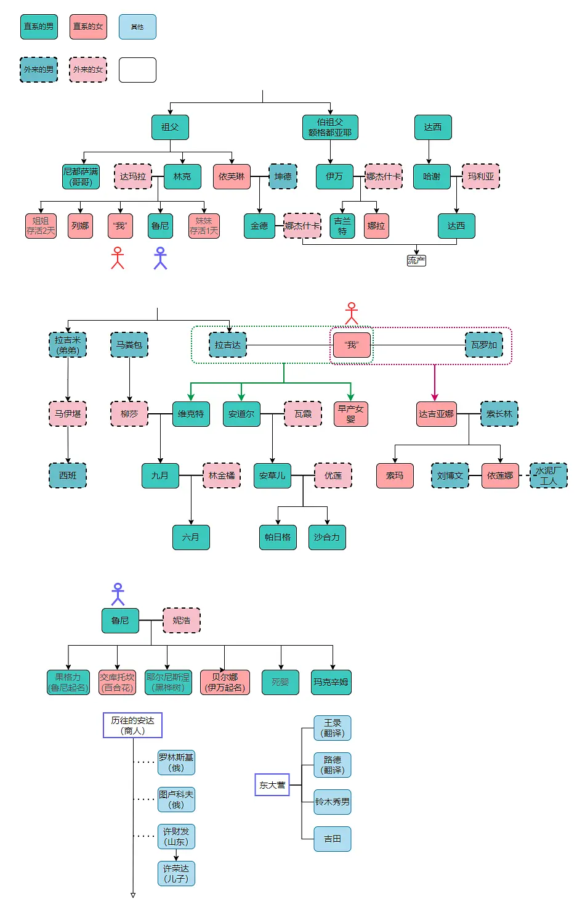

### **剧透版本**

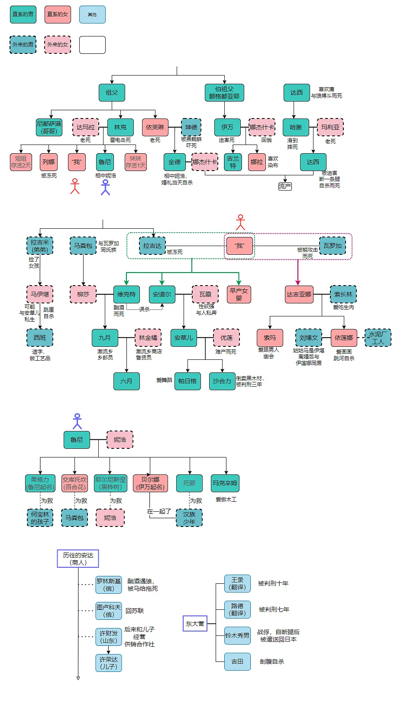

## **时间轴**

1890年，

1891年，

1892年，

1893年，

1894年，

1895年，

1896年，

1897年，

1898年，

1899年，

1900年，

1901年，

1902年，

1903年，

1904年，

1905年，

1906年，

1907年，

1908年，

**1909年，**

列娜出生。（推测）

1910年，

**1911年，**

冬天，主人公出生。（推测）

1912年，

1913年，

1914年，

1915年，

**1916年，**

秋天，列娜病了，主人公大约四五岁。

**1917年，**

鲁尼出生。（推测）

1918年，

1919年，

1920年，

1921年，

**1922年，**

神鹿玛鲁王出生。

1923年，

1924年，

**1925年，**

瓦罗加妻子去世。（推断）

**1926年，**

**时间不详：**

哈谢父亲达西去世，与狼搏斗而死。

夏天，鲁尼八九岁（推测）

斯特若衣查节，庆祝丰收的传统节日。

林克被雷电劈死。

冬天时，哈谢和玛利亚生了小达西。

1927年，

1928年，

1929年，

**1930年，**

拉吉米出生，男。（推断）

1931年，

1932年，民国二十一年

图卢科夫说，日本来了，成立了“满洲国”。

1933年，

1934年，

1935年，

1936年，

1937年，

1938年，

1939年，

1940年，

1941年，

**1942年，民国三十一年，康德九年**

春天，妮浩做了萨满，

神鹿玛鲁王死了，活了有二十年。

依芙琳强行为金得定下了与杰芙琳娜的婚期。但金德自己上吊了，杰芙琳娜成为寡妇。

小达西向杰芙琳娜表白。

秋天，妮浩生了第二个孩子，交库托坎，女孩。

冬猎开始的时候，男人们又被召集到东大营受训去了。

冬天，鲁尼当族长

**1943年，康德十年**

夏天，山上“黄病”流行，日本人取消了东大营的集训。持续近三个月，夺去了三十多人的性命。

深秋，十三岁的拉吉米来到主人公部落。

冬天，妮浩的孩子，果格力死了，从很高松树上掉下来摔死。

**1944年，康德十一年**

夏天，拉吉米被铃木秀男带去东大营。

**1945年，**

日本就战败投降了。

八月上旬，苏军攻击轰炸东大营。瓦罗加跟主人公求婚。

秋天，满洲国灭亡了。

秋末，妮浩生了耶尔尼斯涅，男孩。

小达西和杰芙琳娜结婚。

主人公和瓦罗加结婚。

**1946年，**

秋天，瓦罗加和主人公生下达吉亚娜。

‍

1947年，

1948年，

1949年，

**1950年，**

马伊堪出生。（推测）

1951年，

1952年，

1953年，

1954年，

**1955年，**

春天，维克特和柳莎结婚。

1956年，

1957年，

1958年，

1959年，

**1960年，**

安草儿出生。（推断）

1961年，

1962年，

1963年，

**1964年，**

夏天，玛克辛姆出生，男。妮浩与鲁尼生，鲁尼给他起名。

九月，

**1965年，**

年初，设立激流乡，建造定居点。

秋天，达吉亚娜十九岁。

冬天，大兴安岭被大规模开发，林业工人进驻。

1966年，

**1967年，**

定居在激流乡的各个部落的人回到山上。

夏天，达吉亚娜和索长林结婚。达吉亚娜选择了索长林，没选高平路。

马伊堪十七岁。

贝尔娜失踪。

**1968年，**

夏天，达吉亚娜生下了依莲娜。

造反派抓走伊万和小达西。乡长齐格达解救两人。最终伊万去世。达西断了一条腿。乡长被革职。

冬天，乡长齐格达死了，误入捕兽的陷阱而摔死。

**1969年，**

夏天，坤得去世，被黑蜘蛛吓死。

安草儿九岁。

玛克辛姆五岁。脖子上生了烂疮，依芙琳给他吹好后去世。

妮浩救治过得汉人来报恩，带了酒和糖果。

1970年，

**1971年，**

激流乡的教师高平路这几年多次向马伊堪求婚无果。

**1972年，**

秋天，小达西用枪自杀去世。杰芙琳娜吃毒蘑去世，为小达西殉情。

1973年，

**1974年，**

瓦罗加去世，被熊攻击而死。

1975年，

1976年，

维克特去世，因酗酒过度而死。

‍

**1977年，**

“九月”和林金橘结婚，林金橘是激流乡商店的售货员。

**1978年，**

达吉亚娜和索长林的女儿索玛去世。达吉亚娜怀胎6月时流产了。

伊莲娜十岁。

安草儿和优莲结婚。

**1979年，**

优莲难产大出血去世。生下一对双胞胎。双胞胎叫帕日格、沙合力。

**1980年，**

春天，马伊堪三十岁，怀上了私生子西班。（推测，可能是安草儿的）

1981年，

**1982年，**

西班两岁。

伊堪去世，伊堪给西班断了奶后，跳崖自杀。

主人公说，依莲娜大概十一岁吧（推测，其实十四岁了）

玛克辛姆十八岁。

1983年，

1984年，

1985年，

1986年，

1987年，（推测）

刘博文来参访依莲娜。

“九月”和林金橘生了“六月”

马粪包去世。

1988年，

1989年，

1990年，

依莲娜和水泥厂的工人结婚。

双胞胎帕日格、沙合力均十一岁。

1991年，

依莲娜和水泥厂的工人离婚。依莲娜跟刘博文住在一起。

1992年，

1993年，

1994年，

1995年，

1996年，

1997年，

1998年，

初春，山中发生了大火。妮浩去世，跳神祈雨扑灭山火。

贝尔娜和那个汉人偷驯鹿少年回来。参加完葬礼又走了。

秋天，鲁尼去世。

1999年，

沙合力砍伐受国家保护的天然林，打算偷运卖黑材。

2000年，

春天，依莲娜去世。依莲娜画完妮浩祈雨场景，跳河自杀。

2001年，

玛克辛姆身上出现异常，将要成为新萨满。

沙合力被判刑三年。（推测）

‍

未完待续~

‍

## **参考:**

《中国鄂温克族》-朝克

《中国鄂伦春族》-关小云

人物关系图（额尔古纳河右岸）书评 https://book.douban.com/review/12957999/

创建时间：
2022-09-11 16:25:16 北京